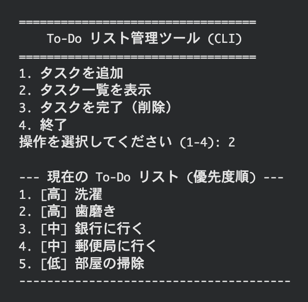

# To-Do リスト管理ツール (CLI)
このプロジェクトは、Pythonのコマンドラインインターフェース（CLI）で動作するシンプルなTo-Doリスト管理ツールです。タスクの追加、優先度付け、表示、および完了（削除）の機能を提供します。

## 📸 デモンストレーション

---

## 🧐 開発背景
日常的なタスク管理において、GUIベースの多機能ツールが抱える課題に対し、**コマンドラインインターフェース（CLI）が持つ本質的な「シンプルさ」と「即時性」**をもって対抗するために着想されました。

1. CLIの「シンプルさ」と「即時性」の価値
  * 作業の邪魔をしない設計: 普段エンジニアや開発者が作業しているターミナル上で直接操作できるため、視覚的なノイズや煩雑な画面遷移がなく、思考の流れを中断させずにタスクの追加・確認ができます。これは、タスク管理の即時性と、ユーザーの集中力維持に貢献します。
  * 純粋な機能への特化: タスクの追加、優先度付け、完了という中核機能のみに絞り込むことで、ツールの操作に関する学習コストを極限まで下げ、真に手軽なタスク管理を実現しています。

2. 実用的な優先度管理の実現
  * 優先度に基づく自動ソート: 登録時に指定した優先度（高・中・低）に基づいて、タスク一覧を自動で並び替えて表示します。これにより、ユーザーはリストを一瞥するだけで作業の優先順位を迷うことなく把握でき、効率的な意思決定を支援します。
  * 安全な削除ロジック: 優先度でソートされた表示順序と、内部のデータリストのインデックスのズレを防ぐための安全な削除処理ロジックを採用しています。これにより、ユーザーは常に目に見える番号で安心してタスクを完了できるという、実用上の信頼性を確保しています。

---

## 🚀 機能一覧
* **タスクの追加**: タスク名と優先度（高 / 中 / 低）を指定してタスクを追加できます。
* **優先度ソート**: タスク一覧表示時、自動的に優先度順（高 → 中 → 低）に並び替えて表示します。
* **データ永続化**: 終了時または実行中にタスクリストを todo_data.json ファイルに自動保存・読み込みます。
* **安全な削除**: ソートされて表示された番号で、インデックスのズレを気にせず正確にタスクを削除できます。

---

## 🛠️ 技術的なポイント
* データ構造の採用: タスクはシンプルな文字列ではなく、キーを持つ辞書として管理されます。これにより、複数の属性（タスク名と優先度）を一つの要素として扱えます。
* 優先度ソートのロジック: タスクのソートには、Pythonの sorted() 関数と、カスタムの key 関数を使用しています。
  1. priority_map = {"高": 1, "中": 2, "低": 3} を定義し、文字列を数値にマッピング。
  2. get_priority_value 関数が、タスクの優先度をこの数値に変換し、sorted() 関数にソート基準を提供します。
* 削除処理の安全性: 一覧表示時と内部データ（todo_list）のインデックスのズレを防ぐため、以下の手法を採用しています。
  1. view_tasks がソート後のリスト（sorted_list）を返します。
  2. complete_task は、その sorted_list とユーザーが入力した番号を使って、削除対象のタスク辞書そのものを特定します。
  3. todo_list.remove(task_to_delete) を使用し、インデックスではなく辞書の内容を比較して元のリストからタスクを削除します。これにより、データの一貫性を保ちます。

---

## 💻 実行方法
1. 上記の todo_app.py ファイルを保存します。
2. ターミナルまたはコマンドプロンプトで以下のコマンドを実行します。
   python todo_app.py

----- **English Version** -----

## To-Do List Management Tool (CLI)

This project is a simple To-Do list management tool implemented in Python, designed to be run via the Command Line Interface (CLI). It provides core functionalities for adding, prioritizing, viewing, and completing (deleting) tasks.

## 📸 Demonstration

---

## 🧐 Development Background
This tool was conceived to counter the challenges posed by multi-featured GUI-based applications in daily task management, specifically by leveraging the inherent simplicity and immediacy of the Command Line Interface (CLI).

1. Value of CLI's Simplicity and Immediacy
* Non-disruptive Design: The tool operates directly within the terminal where developers and engineers commonly work. This eliminates visual noise and cumbersome screen transitions, allowing for the addition and review of tasks without interrupting the user's flow of thought. This significantly contributes to the immediacy of task management and the maintenance of user concentration.
* Focus on Core Functionality: By concentrating solely on core functions—adding tasks, prioritizing, and completing them—the tool minimizes the learning curve and provides a truly effortless task management experience.

2. Implementation of Practical Priority Management
* Priority-Based Auto-Sorting: Tasks are automatically sorted and displayed based on the assigned priority (High, Medium, Low). This allows users to grasp their work priorities without hesitation at a glance, supporting efficient decision-making.
* Safe Deletion Logic: A secure deletion logic is implemented to prevent index misalignment between the priority-sorted display order and the internal data list. This ensures high operational reliability, allowing users to confidently complete tasks using the visible index numbers.

---

## 🚀 Key Features
* **Task Addition**: Users can add a task by specifying the task name and its priority (High / Medium / Low).
* **Priority Sorting**: The task list is automatically sorted and displayed in **priority order** (High -> Medium -> Low).
* **Data Persistence**: The task list is automatically saved to and loaded from the `todo_data.json` file upon exit or launch.
* **Safe Deletion**: Tasks can be reliably deleted using the number displayed in the sorted list, eliminating index mismatch issues.

---

## 🛠️ Technical Deep Dive
* **Data Structure**: Tasks are managed not as simple strings, but as **Dictionaries** with specific keys. This allows for handling multiple attributes (task name and priority) as a single element.
* **Priority Sorting Logic**: The sorting mechanism utilizes Python's built-in `sorted()` function combined with a custom `key` function.
    1. A mapping dictionary, `priority_map = {"高": 1, "中": 2, "低": 3}`, is defined to translate priority strings into sortable numerical values.
    2. The `get_priority_value` function converts the task's priority string into this numerical value, providing the sort criterion for the `sorted()` function.
* **Safe Deletion Process**: To prevent index discrepancies between the displayed (sorted) list and the internal data list (`todo_list`), the following method is employed:
    1. `view_tasks` returns the sorted list (`sorted_list`).
    2. `complete_task` uses the `sorted_list` and the user-inputted number to identify the **exact task dictionary** intended for deletion.
    3. `todo_list.remove(task_to_delete)` is then used. This method compares the **content** (the entire dictionary) rather than the index, ensuring that the correct task is removed from the original internal list, maintaining data integrity.

---

## 💻 How to Run
1. Save the `todo_app.py` file mentioned above.
2. Execute the following command in your terminal or command prompt:
   python todo_app.py
